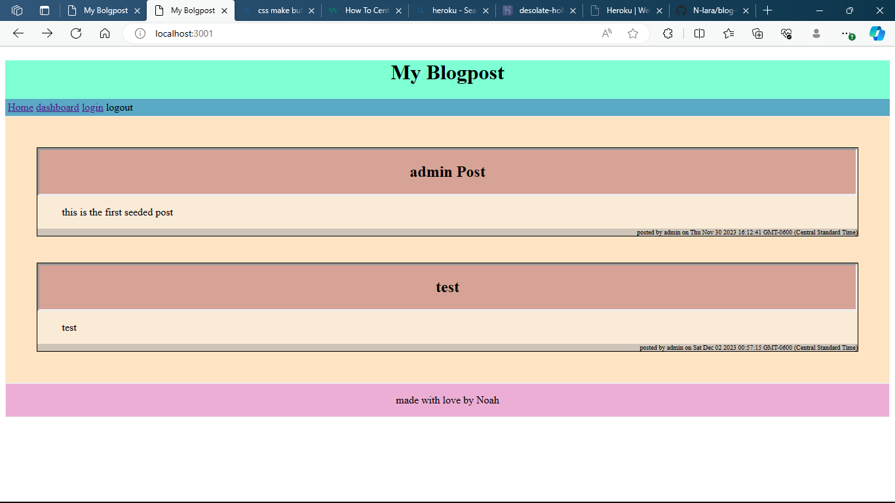
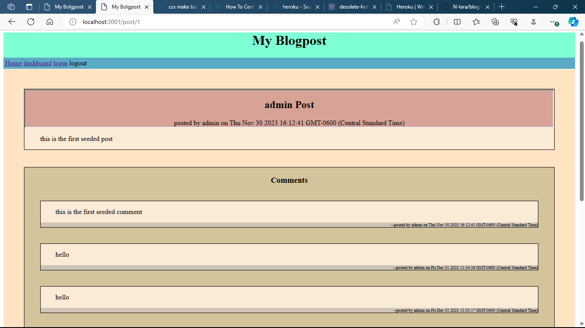

# My blogpost website

## Description

I embarked on the journey to create this blogpost so that me and my fellow students could have a place to share morsels of knowledge and ways of thinking among each other.

## Table of Contents (Optional)

- [Installation](#installation)
- [Usage](#usage)
- [Credits](#credits)
- [License](#license)

## Installation

This project it running on heroku you only need to go to https://desolate-hollows-52185-78d44b985b86.herokuapp.com/ and its ready to go. However if you would like to bring it onto your local machine for developing, then you would need to do a git clone of the repo, then do a NPM install of the dependancies, then use mysql(or your database of choice) to source the schema file located at ./db/schema.sql in relation to the root, then use npm run seed to seed the database there isnt much seed data but it will get you started, then you can use node to run server.js and open the app up on port 3001 unless you change it or have a process.env.PORT set up. 

## Usage

this program is designed to be used to interact with other people you view posts, and if you feel inclined to do so so you can use all the features of this web app you can make an account so you can make posts and also comment on posts, you can also use your dashboard to interact with posts you have prevously made to edit or delete them. 

heroku deployment: https://desolate-hollows-52185-78d44b985b86.herokuapp.com/    
github repo: https://github.com/N-lara/blog-website    
      

## Credits

this web app was created by Noah Lara. I used the npm packages bcrypt, sequelize, connect-session-sequelize, dotenv, express.js, express-handlebars, express-session, and mysql2 in the making of this project and give credit to the developers of those handy packages as well.

## License

N/A

## Future Development

there is currently a issue where it does not reload the page after making a put, post, or delete request and you need to reload the page to have the changes show on the webpage that is a bug needing to be fixed. also in the future adding functionality to delete comments would be cool. another cool feature would be following users that you like.